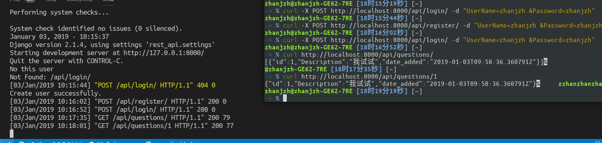

# 数据库系统实验作业

----

一个简易网站


## 文件夹说明
```
├── db_site  # JanHoChoi 编写的Django示例
├── py_website # OnlyCaptain 编写的带数据库 Quora 示例
└── venv # 虚拟环境

```

## py_website 项目说明

```
py_website
├── db.sqlite3
├── manage.py  # 运行文件
├── pyapp
│   ├── admin.py  # 管理文件，在model创建的数据需要在这里进行注册
│   ├── apps.py 
│   ├── forms.py  # 从前端返回数据需要用到的格式文件，例如 登录、注册功能
│   ├── __init__.py 
│   ├── migrations  
│   ├── models.py  # 定义数据文件，Quora 数据库表创建的地方
│   ├── static
│   │   └── css
│   │       └── login.css
│   ├── templates   # 此处放置的是前端的网页代码
│   │   ├── base.html
│   │   ├── confirm.html
│   │   ├── index.html
│   │   ├── login.html
│   │   ├── question.html
│   │   ├── questions.html
│   │   └── register.html
│   ├── tests.py
│   ├── urls.py  # url 管理的文件，新建url需要在这里注册
│   └── views.py  # 视图函数，url里面调用的函数放在这里
└── py_website
    ├── __init__.py
    ├── settings.py  # 数据库存放位置定义
    ├── urls.py  # 声明 app 的url的地方
    └── wsgi.py

```


### 运行说明

- 代码迁移之后：

```bash
python manage.py migrate
```

- 运行在本地：

```bash
python manage.py runserver
```

- 监听来自其他人的连接（部署在服务器上）

    - 在`py_website/settings.py` 文件中修改表项：`ALLOWED_HOSTS = []` 里面添加你的 ip 地址。
    - 运行：

    ```bash
    python manage.py runserver 0.0.0.0:8000
    ```

## rest_api 使用方式

示例：

- 注册

  ```bash
  curl -X POST http://localhost:8000/api/register/ -d "UserName=zhanjzh &Password=zhanjzh"
  ```

- 登录：

  ```bash
  curl -X POST http://localhost:8000/api/login/ -d "UserName=zhanjzh &Password=zhanjzh" 
  ```

- 拉取问题列表：

  ```bash
  curl http://localhost:8000/api/questions/ 
  ```

- 拉取详细问题：

  ```bash
  curl http://localhost:8000/api/questions/1
  ```

运行结果：

<center>
    
</center>

